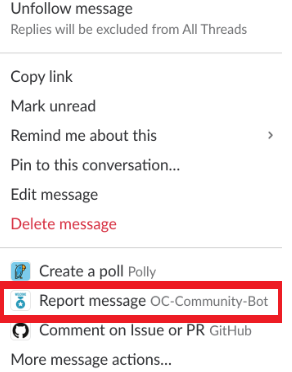

# Moderation Standard Operating Procedures

The main objective of this SOP is to align our moderation procedures with Operation Code’s purpose:

"A non-profit charity helping the military community learn software development, enter the tech industry, and code the future."

Good guidelines protect our members and community culture. Great guidelines will push our community forward. This is a living document and PR’s for improvements are encouraged, if you are interested in becoming a moderator please sign up as a volunteer at https://op.co.de/volunteer-signup

## Reporting Abuse

Members might report abuse directly to a member of the moderator team or by using the report feature on Slack.

## Moderation Team

Operation Code’s Moderation Team is a volunteer group of active members. Moderators are expected to:

1. Treat moderation instances the same across the board

2. Moderate thoughtfully and with respect to community values

3. Document feedback and make suggestions

4. Lead by example

*Tips to Avoid Burnout*

* Carve out balance (set hours you are in the community, and out of it)

* Self-care: get moving, have a mantra, reward yourself when you face something hard

* Model this behavior in the community, and share it back to encourage the example. (Ex: "Post a picture of what you did this weekend!")

## Moderation Guidelines

The guiding principle for moderation of our Slack channel, events and other Operation Code activities is our [Code of Conduct](https://github.com/OperationCode/operationcode_docs/blob/master/community/code_of_conduct.md). As a moderator, you should be familiar with the code of conduct and apply your best judgment when dealing with conflict and/or inappropriate behavior in our communication channels as outlined in the code of conduct and the Violation workflow below. There will be instances when situations are not included in the Violation guidelines, when in doubt of how to proceed to utilize the buddy system, reach out to one of the moderators and discuss next steps.

## Violation Workflow

Instances of abusive, harassing or otherwise, unacceptable behavior may be reported by contacting the project team at staff@operationcode.org. For real time discussion of behavior in public slack channels that should be moderated, an "@here" message in the #oc-mods channel should be utilized to call the issue to the attention of all moderators online. All complaints will be reviewed and investigated and will result in a response that is deemed necessary and appropriate to the circumstances. The Moderator Team is obligated to maintain confidentiality with regard to the reporter of an incident. Volunteers who do not follow or enforce the Code of Conduct in good faith may face temporary or permanent repercussions as determined by other members of the staff.

In most situations (with the exception of severe violations of the Code of Conduct, which is explained below), the process of enforcement is Warning, Temporary Ban, Permanent Ban.

## Warning

A staff member or moderator will warn someone that their behavior violates our Code of Conduct and ask them to stop the behavior via email and Slack DM. A screenshot of the offense will be included with the message.

Warnings should be applied for the following:

* SPAM in Posts

* Advertisement of personal projects in an off-topic context

* Profanity, abuse or disrespectful language

* Purposefully being argumentative or aggressive

Canned message to violator:

*Hi [Name],*

*Operation Code is committed to building a safe, welcoming, harassment-free culture for everyone. We do not merely want a community that is free from hostility; we want one that is actively welcoming and inclusive. Your post in the community’s Slack Channel contains content that violates our **[Code of Conduct](https://github.com/OperationCode/operationcode_docs/blob/master/community/code_of_conduct.md)**. To include [Offense description].*

*We ask that you no longer post content of this nature, for additional guidance please review our **[Code of Conduct](https://github.com/OperationCode/operationcode_docs/blob/master/community/code_of_conduct.md)** and/or reply to this message. Help us keep Operation Code’s Slack channel a place we all want to be in.*

*Thanks in advance,*

*Moderator*

## Temporary Ban

If they continue the behavior after a warning, a moderator will temporarily move the person who is violating the Code of Conduct to a private "timeout" channel separate from other channels, where they will be unable to interact with other channels.

The moderator will first create the "timeout" channel with name format `#timeout-<member-name>`. Then, from the Slack client’s top-left menu, click ‘Administration > Manage members’. A browser will open to Slack’s admin ‘Manage members’ page. Search for the user, select ‘Change to Guest’, and change the violating member to a Single Channel Guest, restricted to the `#timeout-<member-name>` channel.

The length of this timeout is 24 hours by default, but that can be altered (shorter or longer) at the discretion of Operation Code staff and moderators.

Slack Temporary Ban Instructions

1. From the Slack client click ‘Manage Members’

2. The browser will open to the manage members panel.  Search for the user.

3. Select ‘Change to Guest’

4. Change to ‘Single-Channel Guest’

5. Select the channel you want to move the user too (you will need to create the channel first) and set a time limit, click save.

Canned message to violator:

*Operation Code is committed to building a safe, welcoming, harassment-free culture for everyone. We do not merely want a community that is free from hostility; we want one that is actively welcoming and inclusive. Your post in the community’s Slack Channel contains content that violates our **[Code of Conduct](https://github.com/OperationCode/operationcode_docs/blob/master/community/code_of_conduct.md)**. To include [Offense description].**

*Your Slack account has been suspended for [XX days], after the temporary suspension time expires you’ll be able to interact in the community, further violations will result in a Permanent Ban. For additional guidance please review our **[Code of Conduct](https://github.com/OperationCode/operationcode_docs/blob/master/community/code_of_conduct.md)** and/or reply to this message. Help us keep Operation Code’s Slack channel a place we all want to be in.*

*Best,*

*Moderator*

## Permanent Ban

If someone continues violating the Code of Conduct after their Temporary Ban is complete (or in the private "timeout" channel during their Temporary Ban) staff or moderators will permanently ban that person by deactivating their Slack account.

Canned message to violator:

*Your post in the community’s Slack Channel contains content that violates our **[Code of Conduct](https://github.com/OperationCode/operationcode_docs/blob/master/community/code_of_conduct.md)**. To include [Offense description]. You’ve been previously warned to discontinue this type of disruptive behavior.  As a result of your repeated Violation of our **[Code of Conduct](https://github.com/OperationCode/operationcode_docs/blob/master/community/code_of_conduct.md)** you have been permanently banned.*

*If you have any questions you might reply to this e-mail,*

*Best,*

*Moderator*

## Zero Tolerance Violations

A permanent ban will be implemented for any and all violations in the #mental-health, and #the-future-is Slack channels.

In the cases of severe violations of the Code of Conduct (including but not limited to sexual harassment or publicly posting someone's private information) staff and moderators will immediately proceed to a Temporary Ban and consult with other staff on whether an immediate Permanent Ban is appropriate. If a majority of staff feel an immediate Permanent Ban is warranted, the person's Slack account will immediately be deactivated.

This process applies to all Operation Code members, staff, partners, community, and anyone else who interacts with the Operation Code organization. Attempting to get around a temporary or permanent ban by creating a new account in the Operation Code Slack will result in an immediate permanent ban.

For zero tolerance violations, the user’s Slack account will be permanently deactivated.

Canned message to violator:

*Your post in the community’s Slack Channel contains content that violates our **[Code of Conduct](https://github.com/OperationCode/operationcode_docs/blob/master/community/code_of_conduct.md)**. To include [Offense description]. We have a zero tolerance policy when it comes to this kind of behavior. As a result of your Violation of our **[Code of Conduct](https://github.com/OperationCode/operationcode_docs/blob/master/community/code_of_conduct.md)** you have been permanently banned.*

*If you have any questions you might reply to this e-mail,*

*Best,*

*Moderator*

