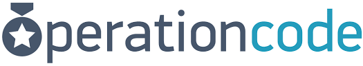

DATE CREATED: December 2018

PROCESS NAME: MENTORSHIP PROGRAM

DATE OF LAST UPDATE: 10/30/2019

1. **INTRODUCTION**

**PURPOSE:** To provide Operation Code members (specifically veterans and military spouses) with an avenue to have a one on one conversation with a mentor and get specific advice that will help them achieve their goals (typically, to transition into a job in tech).

**SCOPE:** The process includes members signing up for a 30 minute mentoring session. This typically includes a slack chat or call, possibly a video call, and sometimes pair programming via screen sharing.

**Notable functions out of scope:** Operation Code does not currently support long term mentorship as a formal program, though mentors are encouraged to continue longer relationships with mentees when they find a good fit for such a relationship.

**ROLES AND RESPONSIBILITIES:**

MENTEE:

* Filling out the Mentor Request Form

* Attending the mentoring session

MENTOR:

* Signing up to be a mentor by filling out the Mentor Enrollment form (`/mentor-volunteer`)

* Monitoring the #mentors-internal channel for when a request comes through that they are suitable to claim

* Clicking the button from Pybot when they wish to claim a specific request

* Reaching out to Mentees to set up a session

* Attending the session and providing adequate advice/solutions

* Less formally, responsible for monitoring the relevant slack channels (e.g., Python mentors should monitor #python and #help, possibly #career-advice as well) to see questions from mentees who have not signed up for a formal session, as a lot of mentorship also happens informally in public channels

MENTOR COORDINATOR:

* Ensuring that every mentor request is claimed within a reasonable time frame by reaching out directly to appropriate mentors when required

* Reaching out to mentees for additional details when their requests do not include enough detail to be paired with a mentor

* Ensuring that Mentees are communicated with in a timely manner in the event that their request is not claimed immediately

* Escalating the issue up the Chain in the event that a request is not claimed in a timely manner

* Moderating the #mentors-internal channel

* Responding to mentor related requests/questions received via email or slack DM

* Advocating the use of the mentor program in the public channels

OPERATION CODE CHAIN OF COMMAND (CEO?):

* Providing guidance to mentors on how best to perform their duties

* Finding a mentor for a Mentor Request in the event of an escalation from the Mentor Coordinator

2. **PROCESS**

**PROCESS DESCRIPTION:**  A program which allows for one on one mentorship for answering specific questions and providing appropriate help to achieve career and education goals.

**FLOW:** Mentors and mentees sign up as members on the Operation Code website.

1. The Mentor sign up for formal mentorship via the mentor enrollment form (by using the `/mentor-volunteer` slack command), which populates their mentor record in Airtable, informing the bot of their skill sets and slack name so they can be @mentioned later in the process.

2. Mentees sign up for a mentor via the Mentor Service Request form (by using the `/mentor` slack command). The form determines which skill sets are required to fulfill the mentor request, as well as provides additional details which mentors can use to determine if they are a good fit for the request.

3. Pybot determines which mentors should be mentioned in the #mentors-internal channel and creates a post in that channel with a button for the mentor to click, and all of the relevant information collected from the form. It mentions each mentor so they are alerted when a mentor request has come in.

4. Mentors review the request and decide whether they would like to take it.

5. If no mentors claim the mentee in a timely manner (as determined by the Mentor Coordinator, though it is typically between a few days and a week), the Mentor Coordinator will reach out to the relevant mentors and determine a course of action to ensure the Mentee is paired with a Mentor.

6. During these few days to a week, the Mentor Coordinator also reaches out to the Mentee to inform them that we have received their mentor request and that we are working on pairing them with an appropriate mentor for their specific request.

7. Should the Mentor request get lost (unclaimed) in the chatter of the #mentors-internal channel, the Mentor Coordinator should "bump" the request in some way so that mentors are aware that the request is still unclaimed and that a Mentor still needs to volunteer to take the request.

8. In the event that a reasonable time has passed (typically about a week and a half) and the Mentee has still not been paired with a Mentor, the Mentor Coordinator should escalate the issue to the next level up in the Operation Code Chain of Command. Historically, this has involved a DM to the Operation Code CEO who will be able to encourage more strongly that one of the mentors ought to take the request. This event is rare because most mentor requests are fulfilled before it needs to be escalated.

9. Once a mentor has determined that they would like to take a request, they click the button that Pybot has posted to indicate that they will take the request. Then they reach out to the Mentee to schedule a 30 minute session.

10. The 30 minute session takes place, and Mentees leave the session better prepared to achieve their goals.

11. In the event that the Mentee does not feel like the mentor session was adequate (or for some reason they do not feel they were given proper/enough mentorship) the Mentee can reach out to the Mentor Coordinator to be paired with another mentor for a follow up session.

**BOUNDARIES:**

The process is initiated by an Operation Code member logging into the site and requesting a mentor via the mentorship form (the `/mentor` slack command). The form is set up on the backend to notify the #mentors-internal private Slack channel, which will @mention mentors that match the skill sets requested on the form. One of the mentors who feels capable of taking on the request will press the button in the channel and DM the member on Slack informing them that they will be taking the mentor request and schedule a 30 minute session. The process is complete when the mentorship session has taken place.

**INPUT:** 

*Personnel*: The primary resource that is necessary is personnel: i.e., the mentors themselves. Without enough mentors willing and able to volunteer their time, the program could not exist. The Mentor Coordinator is also a personnel resource central to the process.

*Slack*: Currently, the entire mentorship process is tightly integrated with Slack as a communication tool. Slack provides a platform where the mentor can communicate with mentees, as well as call them for voice chat and screen share for pair programming.

*Airtable*: On the back end, Airtable is used to track the mentor requests allowing for insights about how often specific members request a mentor, and which mentors get paired with each mentee. It also tracks which mentors have which skill sets, so that each mentee is paired with an appropriate mentor.

*Pybot*: Our Slack bot bridges the gap between the mentor data on Airtable and Slack itself. This tool actually performs the @mention in the mentors internal channel and provides a button in the UI so a mentor can claim a request, which will ensure that a mentee does not get bombarded with offers of help from every mentor that might want to help out. It ensures that each mentor has a 1 to 1 pairing with a mentee for any given mentorship session.

**OUTPUT:**

At the close of a successful mentor session, the mentee will have had their questions answered, and if relevant, will have actionable advice on how to carry forward. The process will ensure that members feel like they have resources within the community and that they can achieve their goals quicker due to the advice of the mentors.

**EXCEPTIONS TO ROUTINE PROCESS FLOW:**

In the event that Pybot breaks down in some fashion, the Mentor Coordinator should manually field mentor requests until the bot is back up. This has only happened once.

**POINTS OF CONTROL AND MEASUREMENTS:**

Risks:

* No Mentors are available.

* Technology breakdown (Slack, Airtable, and Pybot must all function properly for the mentor program to work as expected.)

